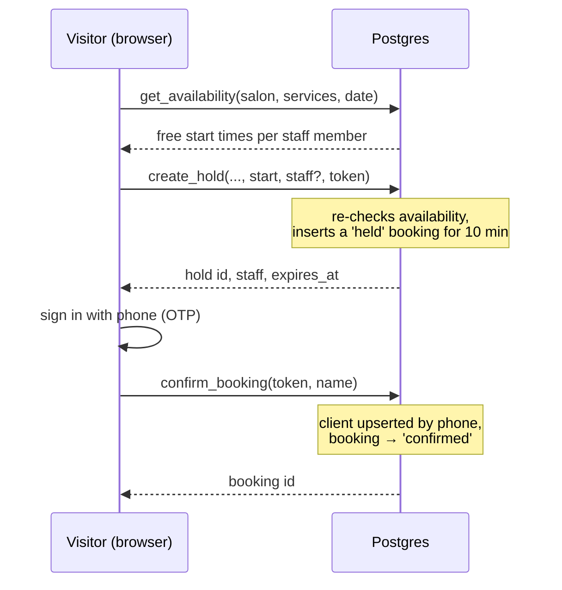

# Booking engine

All booking logic lives in Postgres functions (`supabase/migrations/20261002130000_booking_engine.sql`). The web and owner apps only call them, so neither app can create a double booking, skip a rule or set its own price.

## Hold → confirm

1. **Availability.** Start times step every 15 minutes inside each staff member's working window: their own hours for that weekday, or the salon's opening hours. A start is offered only if it is at least 30 minutes away, within 60 days, and doesn't overlap a confirmed, completed or no-show booking, an unexpired hold, or time off. Combined services need one staff member who offers all of them, for the total duration.
2. **Hold.** The visitor's browser makes up a random token and sends it with the chosen slot. The database checks the slot is still free, then stores a `held` booking for 10 minutes. It keeps only a SHA-256 hash of the token, never the token itself. Each token can hold one slot at a time, and each IP address can make at most 10 holds per hour. The price is computed from the services in the database, never taken from the client.
3. **Confirm.** The visitor signs in with their phone and confirms with the same token. The phone number comes from the verified login, not from a form field. The client record is matched by salon and phone, so a returning client keeps the name the owner gave them.
4. **Afterwards.** Owners and staff change a booking only through `update_booking_status`. Staff can mark their own bookings `completed` or `no_show`. Owners can also cancel. Every change is written to the append-only `booking_events` log.

## Why it can't double-book

Two visitors can both see 10:00 as free and both press "Book". The decision is made by an exclusion constraint on `bookings`: no two active bookings for the same staff member may overlap in time. The second insert waits for the first transaction, then fails. The function turns that failure into `BF409 slot not available`. `supabase/tests/database/03_concurrent_holds.sql` proves this with two real database sessions.

Lapsed holds stay in the table until something marks them `expired`. A constraint can't compare against the current time, so `create_hold` first expires any lapsed holds that overlap the requested slot, then inserts.

## Error codes

| Code | Meaning |
| --- | --- |
| `BF400` | Invalid input |
| `BF401` | No verified phone |
| `BF403` | Business rule (e.g. removing the last owner) |
| `BF404` | Not found |
| `BF409` | Slot not available |
| `BF410` | Hold expired |
| `BF422` | Status change not allowed |
| `BF429` | Too many holds |
| `42501` | Role or ownership problem |

The apps map these through `bookingErrorKind()` in `@bookflow/shared`.
